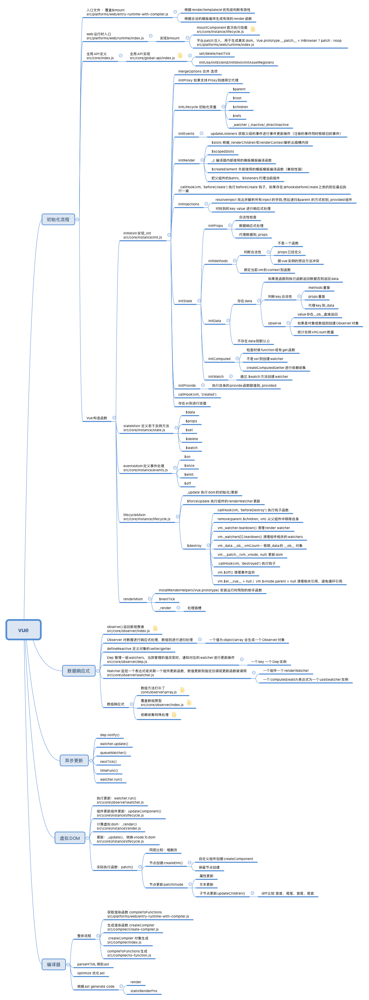

# vue源码阅读

## 思维导图



## 入口
首先查看项目package.json, 找到script>dev。看到对应的配置文件“web-full-dev”，该文件位于 src/platforms/web/entry-runtime-with-compiler.js
```javascript
 "scripts": {
    "dev": "rollup -w -c scripts/config.js --sourcemap --environment TARGET:web-full-dev",
```
### 分析代码

```javascript

const idToTemplate = cached(id => {
  const el = query(id)
  return el && el.innerHTML
})

const mount = Vue.prototype.$mount
// 重新定义mount
Vue.prototype.$mount = function (
  el?: string | Element,
  hydrating?: boolean
): Component {
  el = el && query(el)

  // 不建议元素挂载在html或者body节点
  if (el === document.body || el === document.documentElement) {
    process.env.NODE_ENV !== 'production' && warn(
      `Do not mount Vue to <html> or <body> - mount to normal elements instead.`
    )
    return this
  }

  const options = this.$options
  // 没有render函数
  if (!options.render) {
    let template = options.template
    // 存在tempalte
    if (template) {
      if (typeof template === 'string') {
        // 如果存在#则尝试获取模版
        if (template.charAt(0) === '#') {
          // 带缓存的模版
          template = idToTemplate(template)
          /* istanbul ignore if */
          if (process.env.NODE_ENV !== 'production' && !template) {
            warn(
              `Template element not found or is empty: ${options.template}`,
              this
            )
          }
        }
      }
      // 如果模版不是字符串同时又存在节点类型推测为node节点，获取内部html
      else if (template.nodeType) {
        template = template.innerHTML
      } else {
        if (process.env.NODE_ENV !== 'production') {
          warn('invalid template option:' + template, this)
        }
        return this
      }
    }
    // 存在el则进行hmtl获取
    else if (el) {
      template = getOuterHTML(el)
    }
    // 如果存在有效html模版
    if (template) {
      /* istanbul ignore if */
      if (process.env.NODE_ENV !== 'production' && config.performance && mark) {
        mark('compile')
      }

      // 把template转换成对应的render函数
      const { render, staticRenderFns } = compileToFunctions(template, {
        outputSourceRange: process.env.NODE_ENV !== 'production',
        shouldDecodeNewlines,
        shouldDecodeNewlinesForHref,
        delimiters: options.delimiters,
        comments: options.comments
      }, this)
      options.render = render
      options.staticRenderFns = staticRenderFns

      /* istanbul ignore if */
      if (process.env.NODE_ENV !== 'production' && config.performance && mark) {
        mark('compile end')
        measure(`vue ${this._name} compile`, 'compile', 'compile end')
      }
    }
  }
  //执行挂载
  return mount.call(this, el, hydrating)
}


```